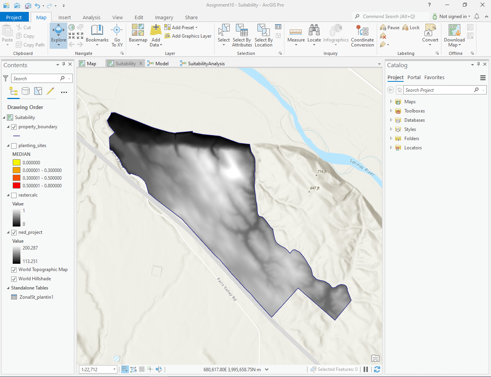
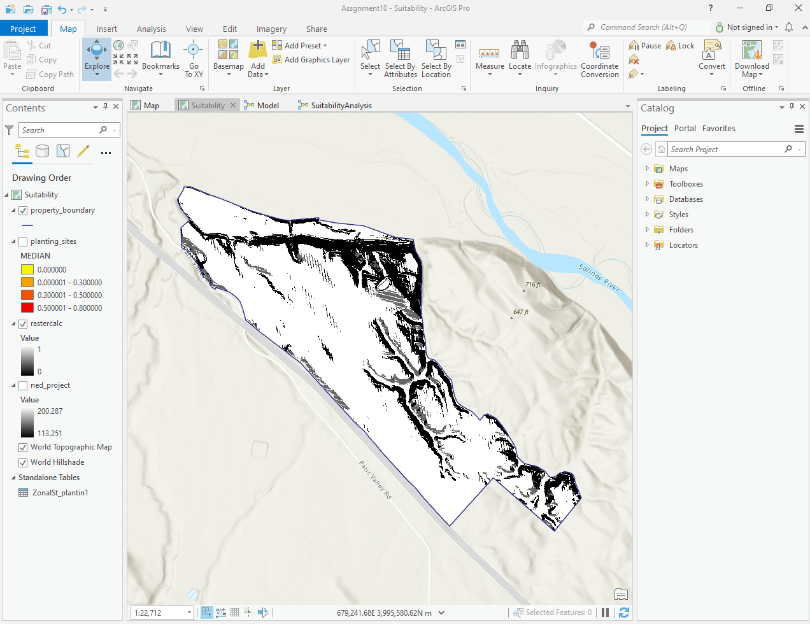
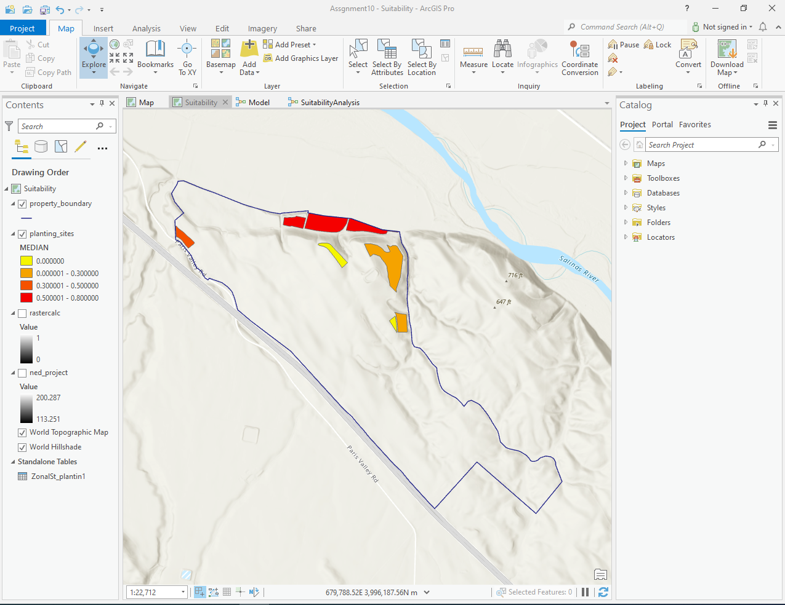

# GIS Data Analysis: Selecting a Suitable Farming Site for Grape Expansion

### Overview

This project aims to determine the most suitable site for expanding grape cultivation on a farm using GIS-based spatial analysis. ArcGIS Pro was used to evaluate various terrain factors, and raster analysis techniques were applied to score potential planting sites. Zonal statistics were then used to summarize these scores for decision-making.

## 🔍 Methodology

1. Data Collection

Acquired DEM (Digital Elevation Model) data for the farm area.

Identified key environmental variables affecting grape growth.

2. GIS Analysis

Aspect Analysis: Determined the orientation of slopes to identify sun-facing areas.

Hill shade Analysis: Modeled sunlight exposure to assess shading effects.

Slope Analysis: Measured terrain steepness to evaluate suitability for planting.

Raster Scoring: Combined the above factors into a weighted scoring system to rank site suitability.

3. Zonal Statistics

Divided the farm into sections based on predefined planting zones.

Applied zonal statistics as a table to aggregate raster scores within each planting section.

Evaluated summary statistics to determine the optimal areas for grape expansion.

## 📂 Repository Contents

Screenshots/ - Includes modelbuilder details and visualizations generated from the analysis.

README.md - Project documentation (this file).

